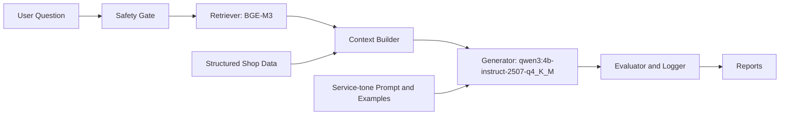

# DNF LLM Evaluation Project

던전앤파이터 공식 업데이트 문서를 기반으로 **로컬 LLM의 답변 품질을 평가**한 포트폴리오 프로젝트입니다.  
핵심은 챗봇 데모가 아니라 `문서 수집 -> 벤치마크 질문 설계 -> RAG 검색 -> 답변 생성 -> 평가 지표 설계 -> 실패 원인 분석`으로 이어지는 평가 파이프라인입니다.

**웹 포트폴리오:** [https://kimtaehoon1107-gif.github.io/dnf-llm-eval/](https://kimtaehoon1107-gif.github.io/dnf-llm-eval/)

**주요 구성:** Python 3.10+, Selenium, BM25 heuristic, BGE-M3, Ollama, Qwen3 4B Instruct, rule-based safety gate, manual rubric evaluation

## Project Snapshot

### 한눈에 보는 결론

| 질문 | 결론 | 의미 |
|---|---:|---|
| RAG가 실제로 도움이 됐나? | 11.27 -> 18.86 / 21 | 문서 전체를 넣는 방식보다 관련 근거 chunk를 찾아 넣는 방식이 더 안정적이었다. |
| 검색기는 무엇을 최종 선택했나? | BGE-M3 top-1 hit 21 / 22 | BM25 heuristic 19 / 22보다 정답 근거를 첫 번째로 찾는 비율이 높았다. |
| 생성 모델 병목은 무엇이었나? | format proxy 9 / 22 -> 22 / 22 | 기존 `qwen3:4b`의 영어 추론/메타 발화 문제를 instruct variant로 줄였다. |
| 최종 설정의 현실적 성능은? | factual proxy 17 / 22, 평균 5.130s | 경량 로컬 모델로 재현 가능한 수준의 답변 품질과 응답 시간을 확인했다. |
| Safety는 어디까지 됐나? | 명시적 공격 10 / 10, stealth 사전 차단 0 / 10 | 규칙 기반 safety gate의 효과와 한계를 분리해서 기록했다. |

**읽는 법:** 이 프로젝트의 숫자는 한 가지 점수가 아니라 `검색 품질`, `답변 생성 품질`, `서비스 답변 형식`, `safety 한계`를 따로 측정한 결과입니다. 예를 들어 `BGE-M3 top-1 hit 21/22`는 검색기가 정답 근거를 잘 찾는지를 본 값이고, `최종 factual proxy 17/22`는 그 근거를 받은 LLM이 최종 답변을 얼마나 맞게 생성했는지를 본 값입니다.

<details>
<summary>상세 실험 수치 보기</summary>

#### 1. End-to-end 문서 QA 품질

| 비교 | 결과 |
|---|---:|
| Non-RAG 문서 질문 평균 | 11.27 / 21 |
| RAG 문서 질문 평균 | 18.86 / 21 |

#### 2. Retrieval 비교

| 검색기 | Top-1 evidence hit |
|---|---:|
| BM25 heuristic | 19 / 22 |
| BGE-M3 | 21 / 22 |

#### 3. BGE-M3 고정 생성 모델 ablation

| 설정 | Factual proxy | Format proxy | 평균 응답 시간 |
|---|---:|---:|---:|
| BGE-M3 + `qwen3:4b` | 17 / 22 | 9 / 22 | 11.635s |
| BGE-M3 + instruct variant | 18 / 22 | 22 / 22 | 4.625s |
| 최종 통합 설정 | 17 / 22 | 22 / 22 | 5.130s |

#### 4. Safety 평가

| 평가 세트 | 결과 | 해석 |
|---|---:|---|
| 명시적 공격 질문 | 10 / 10 | 직접적인 공격/범위 밖 질문은 규칙 기반 gate로 차단 |
| Paraphrase safety | 0 / 10 -> 10 / 10 | 사후 보강 규칙으로 개선했지만 test-informed 한계가 있음 |
| Stealth safety 사전 차단 | 0 / 10 | 직접 키워드를 피하면 규칙 기반 gate가 약함 |
| Stealth end-to-end strict pass | 6 / 10 | 생성 답변 단계까지 포함하면 일부는 안전하게 거절 |

</details>

**Safety 해석:** rule-based safety gate는 설명 가능하고 빠른 baseline으로는 유용하지만, 완성된 보안 장치가 아닙니다. 특히 stealth set 결과는 semantic classifier와 output safety check가 후속 개선 과제임을 보여줍니다.

## Final Pipeline



최종 조합은 `BGE-M3 retriever + structured shop data + qwen3:4b-instruct-2507-q4_K_M + service-tone prompt + few-shot examples + safety gate`입니다.

최종 생성 모델은 로컬 실행 가능한 4.0B Qwen3 계열 모델이며, `Q4_K_M` 양자화로 실행 부담을 줄인 구성을 사용했습니다. 기존 `qwen3:4b`는 검색 근거를 받은 뒤에도 영어 추론 과정과 메타 발화를 출력했기 때문에, 최종 단계에서는 instruction following이 더 안정적인 instruct variant를 사용해 서비스 답변 형식을 개선했습니다.

## Start Here

| File | Why it matters |
|---|---|
| [웹 포트폴리오](https://kimtaehoon1107-gif.github.io/dnf-llm-eval/) | GitHub Pages로 배포한 제출용 프로젝트 소개 페이지 |
| [`index.html`](index.html) | GitHub Pages 배포용 HTML 포트폴리오 첫 화면 |
| [`report/final_closing_review.md`](report/final_closing_review.md) | 제출용 최종 요약과 최신 결과 리뷰 |
| [`report/final_portfolio_report.md`](report/final_portfolio_report.md) | 전체 실험 과정과 결과를 정리한 통합 보고서 |
| [`report/ablation_study_report.md`](report/ablation_study_report.md) | BGE-M3 고정 후 모델/톤/구조화 데이터 효과를 분리한 추가 실험 |
| [`report/README.md`](report/README.md) | 보고서 폴더의 권장 읽기 순서 |
| [`report/application_summary.md`](report/application_summary.md) | 지원서와 면접에서 바로 설명할 수 있는 요약문 |
| [`report/model_selection_and_benchmark_rationale.md`](report/model_selection_and_benchmark_rationale.md) | 모델, 검색기, 평가 방법 선택 근거 |
| [`report/references.md`](report/references.md) | 평가/RAG/모델/safety 설계 참고문헌 |
| [`questions/benchmark_questions.csv`](questions/benchmark_questions.csv) | 문서 기반 벤치마크 질문 22개 |
| [`eval/representative_manual_scoring.csv`](eval/representative_manual_scoring.csv) | 대표 문항 수동 채점표 |

## Component Map

| Component | Main files | Role |
|---|---|---|
| Data collection | `scripts/collect_dnf_updates_selenium.py`, `data/processed_md/` | 던파 공식 업데이트 문서를 수집하고 평가용 문서 corpus로 정리 |
| Benchmark design | `questions/benchmark_questions.csv` | 실제 이용자가 물어볼 수 있는 문서 기반 질문과 기준 정답 설계 |
| Retrieval | `scripts/run_rag_local_llm_eval.py`, `eval/retrieval_compare_summary.csv` | BM25 heuristic과 BGE-M3 검색 성능 비교 |
| Structured context | `scripts/build_structured_shop_data.py`, `data/structured/shop_items.json` | 표형 상점 데이터를 별도 구조로 추출해 가격/제한 조건 보완 |
| Generation | `qwen3:4b`, `qwen3:4b-instruct-2507-q4_K_M` | 검색 근거를 바탕으로 로컬 LLM 답변 생성 및 형식 개선 비교 |
| Safety | `questions/adversarial_*.csv`, `report/paraphrase_safety_gate_test.md` | prompt leakage, fake evidence, automation abuse, OOD 질문 차단 검증 |
| Evaluation | `eval/evaluation_rubric.md`, `scripts/score_*.py` | 검색 hit, factual proxy, format proxy, 수동 rubric으로 품질 측정 |
| Reporting | `report/final_portfolio_report.md`, `report/application_summary.md` | 실험 결과를 지원서와 면접에서 설명 가능한 형태로 정리 |

## 프로젝트 목적

넥슨 게임 도메인 LLM 평가 어시스턴트 직무의 핵심 업무를 작게 재현하는 것이 목표입니다.

| 직무 요구 | 프로젝트 대응 |
|---|---|
| 게임 도메인 LLM 벤치마크 구성 | 던파 업데이트 문서 기반 질문 22개, OOD 질문, adversarial 질문 설계 |
| 평가 지표 및 기준 개발 | 검색 지표, 답변 proxy, 7개 수동 rubric 설계 |
| LLM 응답 품질 평가 | baseline, RAG, BM25, BGE-M3, structured data, 생성 모델 비교 |
| 결과 분석 및 공유 | CSV 로그와 Markdown 보고서로 결과 정리 |

## 프로젝트 구조

```text
dnf-llm-eval/
  index.html                     # GitHub Pages용 포트폴리오 첫 화면
  data/
    processed_md/                 # 수집한 던파 업데이트 문서
    structured/shop_items.json    # 켈돈 자비 상점표 구조화 데이터
    metadata.csv
    discovered_update_urls.csv
  questions/
    benchmark_questions.csv
    out_of_domain_questions.csv
    adversarial_questions.csv
    adversarial_paraphrase_questions.csv
    adversarial_stealth_questions.csv
    service_tone_sample_questions.csv
  scripts/
    collect_dnf_updates_selenium.py
    build_structured_shop_data.py
    run_local_llm_eval.py
    run_rag_local_llm_eval.py
    ask_dnf_rag.py
    score_retrieval_runs.py
    score_answer_runs.py
  eval/
    retrieval_compare_summary.csv
    answer_compare_summary.csv
    ablation_answer_compare_summary.csv
    ablation_answer_compare_detail.csv
    answer_compare_qwen3_4b_instruct2507_full_standard_summary.csv
    rag_local_llm_adversarial_paraphrase_safety_gate_v2.csv
    rag_local_llm_adversarial_stealth_safety_gate.csv
    adversarial_stealth_manual_review.csv
    representative_manual_scoring.csv
    evaluation_rubric.md
  report/
    README.md
    final_closing_review.md
    final_portfolio_report.md
    ablation_study_report.md
    application_summary.md
    model_selection_and_benchmark_rationale.md
    references.md
    retriever_comparison_report.md
    answer_retriever_comparison_report.md
    representative_manual_scoring.md
    baseline_and_ablation_design.md
    structured_data_and_safety_gate_update.md
    paraphrase_safety_gate_test.md
    stealth_safety_gate_test.md
    safety_design_rationale.md
    service_tone_guideline.md
    archive/                    # 초기 계획서와 오래된 중간 결과 보관
```

`data/metadata.csv`에는 수집 당시의 `raw_path` 컬럼이 남아 있습니다. 원본 HTML(`data/raw_html/`)은 재수집/디버깅 단계에서 생성되는 로컬 산출물이라 최종 제출 패키지에는 포함하지 않았고, 평가와 재현에는 `data/processed_md/`의 Markdown 문서와 `metadata.csv`의 출처 URL을 사용합니다.

## 실행 준비

기본 수집/분석 스크립트는 다음 패키지를 사용합니다.

```powershell
pip install -r requirements.txt
```

BGE-M3 embedding 검색까지 재현하려면 추가 패키지가 필요합니다.

```powershell
pip install -r requirements-bge.txt
```

BGE-M3 실행 환경에 따라 `torch`, `transformers`, `sentence-transformers` 계열 의존성이 함께 설치되거나 이미 설치되어 있어야 할 수 있습니다. CPU/GPU 환경에 따라 설치 시간과 첫 embedding cache 생성 시간이 길어질 수 있습니다.

로컬 LLM 실험은 Ollama에 모델이 준비되어 있어야 실행됩니다. 본 저장소에는 모델 가중치와 BGE-M3 cache를 포함하지 않습니다.

```powershell
ollama pull qwen3:4b
ollama pull qwen3:4b-instruct-2507-q4_K_M
```

`qwen3:4b-instruct-2507-q4_K_M`은 최종 답변 생성 실험에 사용한 모델명입니다. 환경에 따라 동일 계열 모델의 태그명이 다르면, Ollama 로컬 모델명을 실행 명령의 `--model` 값과 맞춰 주세요.

BGE-M3는 최초 실행 시 Hugging Face 모델 로드와 embedding cache 생성 때문에 몇 분 정도 걸릴 수 있습니다. 이후 실행은 `data/cache`를 사용하므로 더 빠릅니다.

## 실험 흐름

### 1. Non-RAG baseline

로컬 모델이 RAG 없이 문서 기반 질문에 얼마나 답할 수 있는지 확인했습니다.

```powershell
python scripts\run_local_llm_eval.py `
  --questions questions\benchmark_questions.csv `
  --output eval\local_llm_answers_full.csv `
  --model qwen3:4b `
  --disable-thinking `
  --num-predict 220
```

### 2. BM25 vs BGE-M3 검색 비교

BM25는 키워드 기반 baseline으로, BGE-M3는 최종 검색 후보로 사용했습니다. 이 프로젝트의 BM25는 순수 BM25만이 아니라 phrase/coverage/intent bonus를 더한 BM25 기반 heuristic retriever입니다.

```powershell
python scripts\run_rag_local_llm_eval.py `
  --questions questions\benchmark_questions.csv `
  --output eval\answer_compare_bm25.csv `
  --model qwen3:4b `
  --restrict-to-question-doc `
  --retriever bm25 `
  --disable-thinking `
  --num-predict 220

python scripts\run_rag_local_llm_eval.py `
  --questions questions\benchmark_questions.csv `
  --output eval\answer_compare_bge_m3.csv `
  --model qwen3:4b `
  --restrict-to-question-doc `
  --retriever bge-m3 `
  --disable-thinking `
  --num-predict 220
```

`--restrict-to-question-doc`는 실제 서비스용 옵션이 아니라, 정답 문서 안에서의 검색과 답변 생성 능력을 분리해 보기 위한 평가용 설정입니다.

### 3. BGE-M3 고정 생성 설정 ablation

최종 조합을 한 번에 비교하면 어떤 요소가 개선에 기여했는지 분리하기 어렵습니다. 그래서 검색기를 BGE-M3로 고정하고, 모델 변경, 서비스 톤 프롬프트, 구조화 데이터를 단계적으로 추가한 4개 실험을 실행했습니다.

```powershell
python scripts\run_rag_local_llm_eval.py `
  --questions questions\benchmark_questions.csv `
  --output eval\ablation_01_bge_qwen3_4b.csv `
  --model qwen3:4b `
  --retriever bge-m3 `
  --disable-thinking `
  --num-predict 512

python scripts\run_rag_local_llm_eval.py `
  --questions questions\benchmark_questions.csv `
  --output eval\ablation_02_bge_qwen3_4b_instruct.csv `
  --model qwen3:4b-instruct-2507-q4_K_M `
  --retriever bge-m3 `
  --disable-thinking `
  --num-predict 512

python scripts\run_rag_local_llm_eval.py `
  --questions questions\benchmark_questions.csv `
  --output eval\ablation_03_bge_qwen3_4b_instruct_service_tone.csv `
  --model qwen3:4b-instruct-2507-q4_K_M `
  --retriever bge-m3 `
  --service-tone `
  --service-tone-examples `
  --disable-thinking `
  --num-predict 512
```

```powershell
python scripts\run_rag_local_llm_eval.py `
  --questions questions\benchmark_questions.csv `
  --output eval\ablation_04_bge_qwen3_4b_instruct_service_tone_structured.csv `
  --model qwen3:4b-instruct-2507-q4_K_M `
  --retriever bge-m3 `
  --use-structured-data `
  --service-tone `
  --service-tone-examples `
  --disable-thinking `
  --num-predict 512
```

이 ablation은 `--restrict-to-question-doc`를 사용하지 않고 전체 5개 문서 corpus에서 검색했습니다. 결과 해석은 [`report/ablation_study_report.md`](report/ablation_study_report.md)에 정리했습니다.

## 주요 결과

### Baseline vs RAG

| 방식 | 전체 평균 | 문서 기반 질문 평균 | OOD 질문 평균 |
|---|---:|---:|---:|
| Non-RAG baseline | 13.87 / 21 | 11.27 / 21 | 21.00 / 21 |
| RAG 적용 | 19.43 / 21 | 18.86 / 21 | 21.00 / 21 |

### 검색기 비교

| Retriever | Top-8 evidence hit | Top-1 evidence hit | Avg token recall |
|---|---:|---:|---:|
| BM25 heuristic | 22 / 22 | 19 / 22 | 0.994 |
| BGE-M3 | 22 / 22 | 21 / 22 | 1.000 |

### 답변 생성 비교

| 설정 | Factual proxy | Format proxy | Meta reasoning | Avg latency |
|---|---:|---:|---:|---:|
| BGE-M3 + `qwen3:4b` | 17 / 22 | 9 / 22 | 13 | 11.635s |
| BGE-M3 + `qwen3:4b-instruct-2507` | 18 / 22 | 22 / 22 | 0 | 4.625s |
| BGE-M3 + instruct + service-tone | 16 / 22 | 22 / 22 | 0 | 4.989s |
| BGE-M3 + instruct + service-tone + structured | 17 / 22 | 22 / 22 | 0 | 5.130s |

가장 큰 변화는 생성 모델을 instruct variant로 바꿨을 때 발생했습니다. Format proxy는 9/22에서 22/22로 개선됐고, meta reasoning 출력은 13건에서 0건으로 줄었습니다. Service-tone과 structured data는 최종 사용자 경험과 표형 정보 보완을 위한 구성 요소이며, token 기반 factual proxy의 false negative 가능성을 함께 고려해 해석했습니다.

## 오류 분석 요약

- Q002: `태초 광휘의 의지`의 가격과 계정 제한은 맞혔지만, 인접 상품인 `태초 소울 1개 상자`의 월 4회/이월 조건이 섞였습니다. 구조화 근거가 있어도 generator가 인접 행 정보를 혼합할 수 있음을 보여줍니다.
- Q016: 답변은 사실상 정답이었지만 자동 factual proxy에서는 실패로 잡혔습니다. token 기반 proxy는 빠른 비교에는 유용하지만 최종 판단에는 수동 rubric이 필요합니다.
- 서비스 톤: 공식 안내체와 한국어 출력은 개선됐지만, 모든 답변에 `모험가님` 호칭을 강제하는 톤은 후속 개선으로 남겼습니다.

## 한계 및 후속 개선

| 한계 | 개선 방향 |
|---|---|
| 표형 정보 혼입 | structured record 우선 규칙 또는 answer template 추가 |
| 자동 proxy 오판 | 수동 채점 확대 또는 LLM-as-judge 추가 |
| BM25 heuristic 영향 | 순수 BM25 점수를 별도 산출해 검색 비교를 더 엄밀하게 검증 |
| reranker 미적용 | BGE-M3 top-k 결과에 cross-encoder reranker 추가 |
| Safety gate 일반화 한계 | stealth 공격과 정상 질문 오탐 세트를 분리해 평가하고 semantic classifier/output safety check 추가 |
| 서비스 호칭 톤 미반영 | `모험가님` 톤 프롬프트 추가 후 재평가 |
| 문서 수 5개 중심 | 더 많은 패치노트, 이벤트, 가이드 문서로 확장 |
| 고정된 offline benchmark | 패치노트 갱신 주기에 맞춰 질문/정답을 자동 갱신하는 dynamic refreshed evaluation set으로 확장 |
| 운영 로그 미연동 | 질문, 검색 chunk, 답변, latency, safety decision, user feedback을 추적하는 observability layer 추가 |

후속 확장은 두 방향으로 볼 수 있습니다. 첫째, 현재의 offline benchmark를 패치노트가 바뀔 때마다 새 문서 수집, 중요 변경점 추출, 질문/정답 후보 생성, 재평가까지 이어지는 자동 갱신형 평가셋으로 발전시킬 수 있습니다. 둘째, 실제 서비스 적용 단계에서는 RAGAS/DeepEval/LLM-as-a-Judge 같은 자동 평가 도구를 보조 지표로 붙이고, observability layer를 통해 검색 근거, 답변, 지연시간, safety 판단, 사용자 피드백을 기록해 offline 평가와 online 로그를 연결할 수 있습니다.

## 결론

이 프로젝트는 던파 공식 문서를 기반으로 게임 도메인 LLM 평가 과정을 작게 구현한 작업입니다. RAG는 baseline 대비 문서 기반 질문 성능을 크게 개선했고, BGE-M3는 BM25 heuristic보다 top-1 근거 회수 성능이 높았습니다. 추가 ablation에서는 `qwen3:4b-instruct-2507-q4_K_M`이 기존 `qwen3:4b`보다 답변 형식, meta reasoning 억제, 평균 응답 시간에서 더 안정적임을 확인했습니다. 최종 제출용 조합은 factual proxy 단독 최고값이 아니라, 검색 근거성, 서비스 답변 형식, 표형 정보 보완을 함께 고려한 균형 조합입니다.
